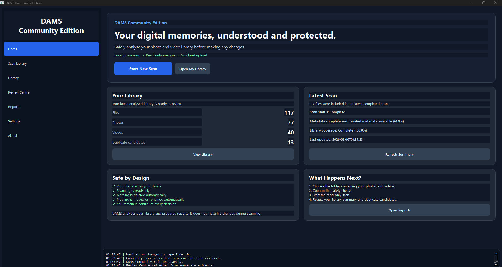
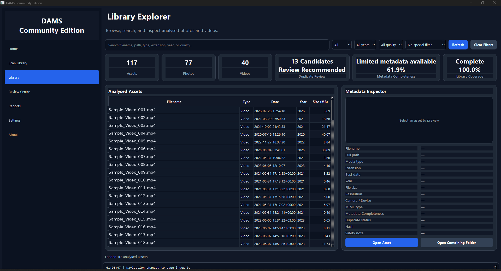
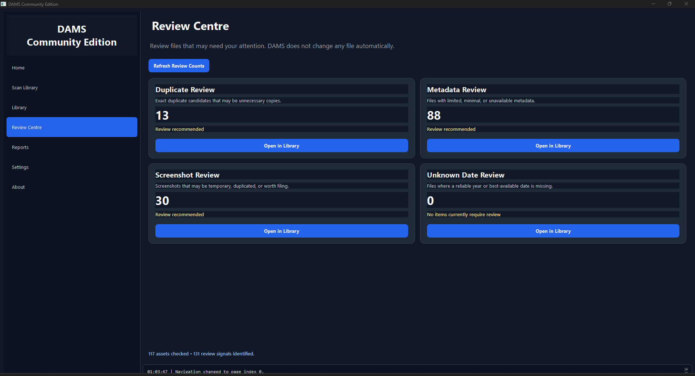
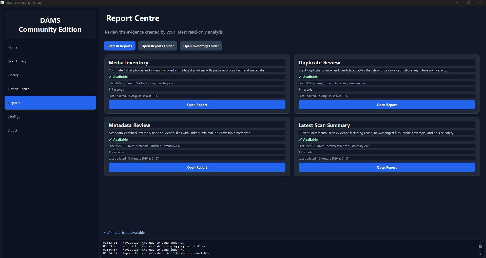
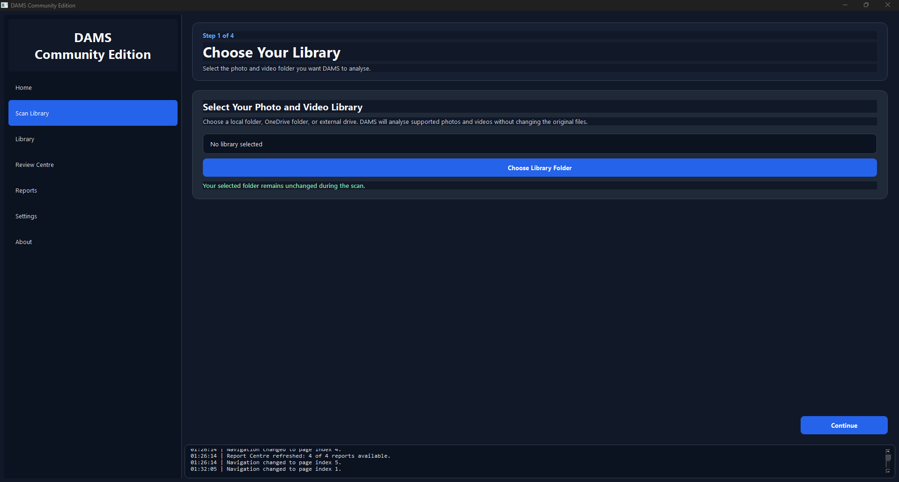

# DAMS Community Edition

**Understand your digital media before reorganising it.**

DAMS Community Edition is a privacy-conscious Windows application for discovering, analysing and understanding personal photo and video libraries.

It provides a guided desktop experience for scanning media, inspecting metadata health, identifying exact duplicate candidates and reviewing library evidence before making organisation decisions.

## Community Edition v1.0.0

**Status:** Certified Community Release  
**Platform:** Windows  
**Release:** 1.0.0

## See DAMS in action

DAMS Community Edition provides a guided, local-first workflow for understanding a media library before making organisation decisions.

### Home

See the latest analysed library at a glance, including asset counts, duplicate candidates, metadata completeness and scan status.

### Library Explorer

Browse, search and inspect analysed photos and videos with library coverage, metadata quality and duplicate-review indicators.

### Review Centre

Identify duplicate candidates, metadata issues, screenshots and other files that may need attention before making any decisions.

### Report Centre

Review the evidence generated by the latest read-only analysis, including inventory, duplicate, metadata and scan-summary reports.

### Guided Library Scan

Select a local folder, OneDrive folder or external drive for read-only analysis while the source library remains unchanged.

## Core capabilities

- Recursive media-library discovery
- Multi-source media analysis
- Photo and video inventory
- Metadata extraction and enrichment
- Metadata quality assessment
- SHA-256 exact duplicate identification
- Media-source validation
- Library search and review
- Runtime health and evidence reporting
- Local-first processing

## Privacy-first design

DAMS Community Edition is designed around local processing.

The core Community workflow does not require users to upload their personal media to an external AI service.

## Safety model

The primary Community workflow focuses on:

**Discover -> Analyse -> Understand -> Review**

Users should maintain appropriate backups before making independent changes to valuable media libraries.

## Download

Download the certified Windows installer from this repository's GitHub Releases section.

For v1.0.0, verify the installer against the published SHA-256 checksum.

See:

- docs/INSTALLATION.md
- docs/VERIFY_DOWNLOAD.md
- docs/RELEASE_NOTES_v1.0.0.md
- docs/KNOWN_LIMITATIONS.md

## Current scope

Community Edition v1.0.0 focuses primarily on personal photo and video libraries.

Future DAMS editions may introduce broader digital-resource intelligence, governed lifecycle actions, additional resource types, mobile clients, APIs and external connectors. Those capabilities are not claims about v1.0.0.

## Feedback

Real-world testing, bug reports, usability observations and constructive feedback are welcome.

See FEEDBACK.md.

## Author

Developed by **Eugene Gakpo Alhassan**.

## Licensing

DAMS Community Edition is distributed under the Community Edition license included in this repository.

The private DAMS engineering source code is not included in this public distribution repository and is not licensed as open-source software by this repository.

